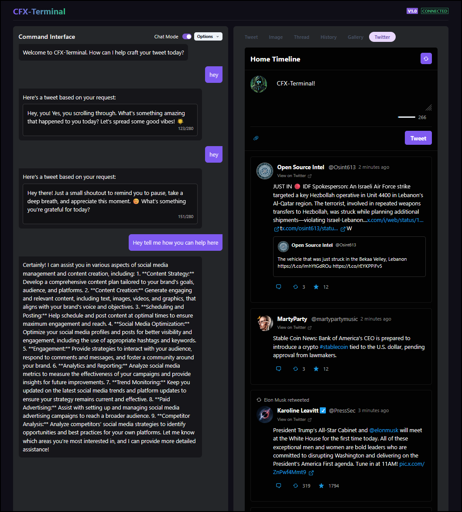
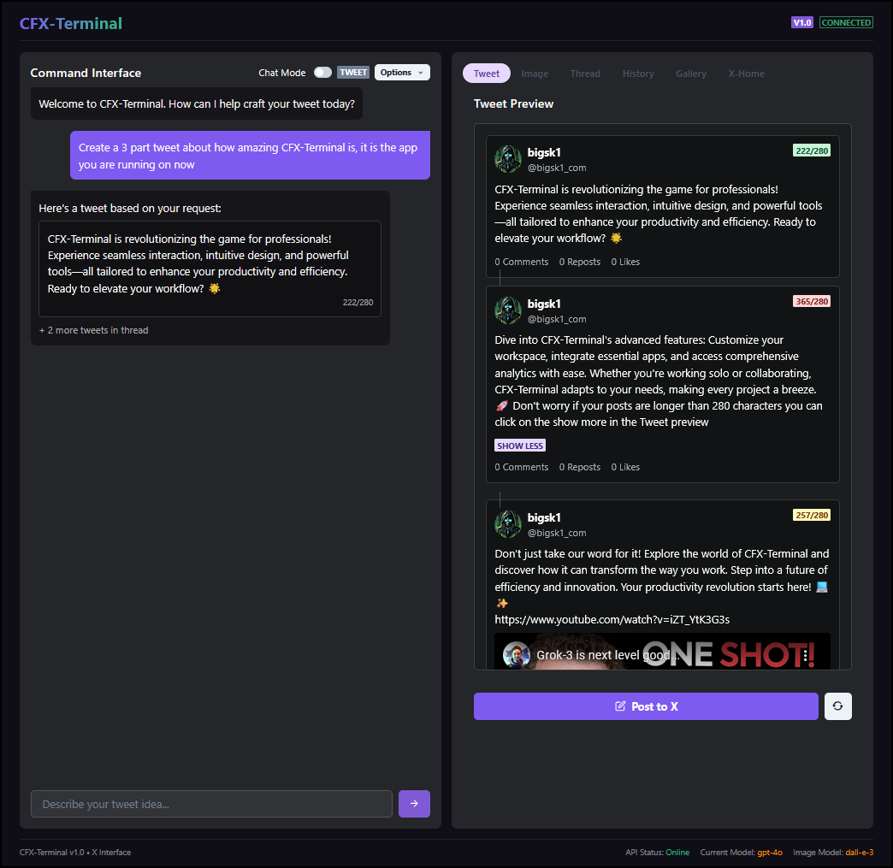
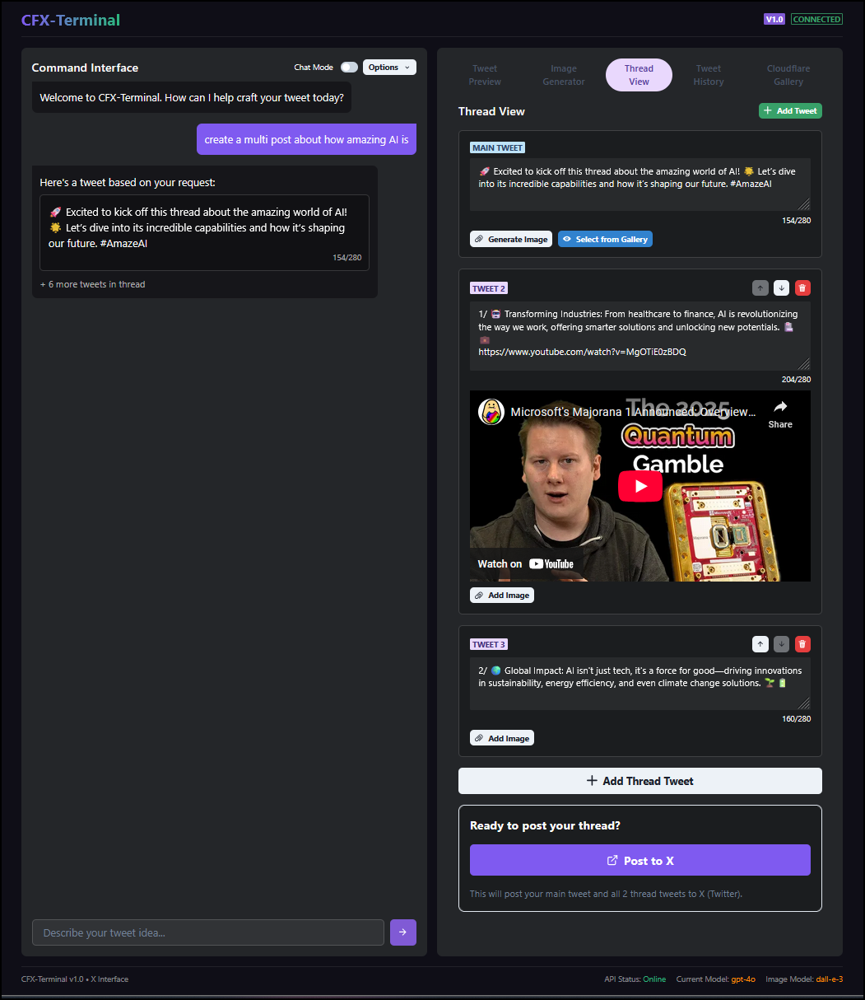
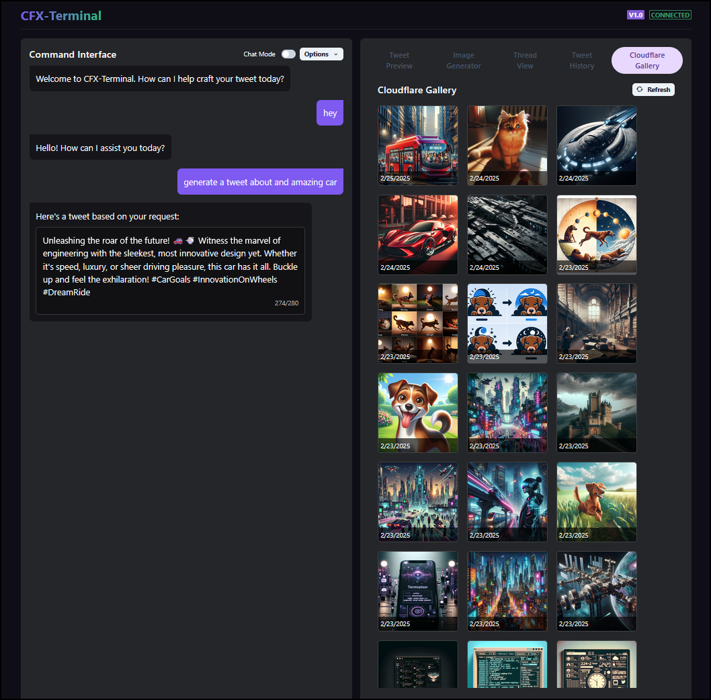
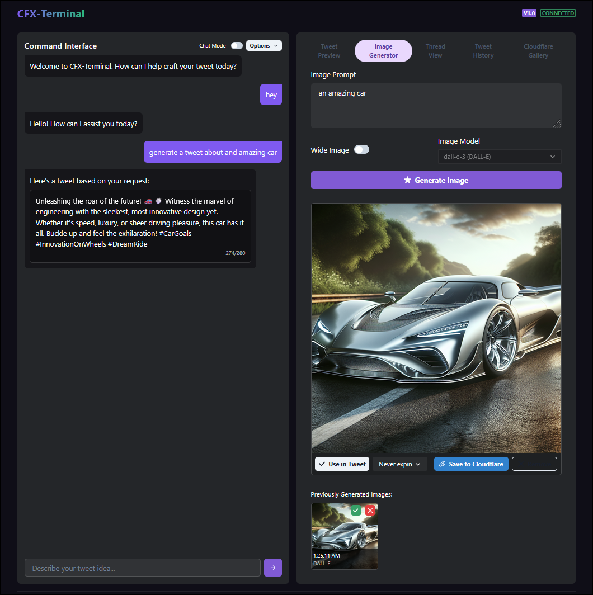

# CFX-Terminal: AI-Powered X (Twitter) Client

A web application that combines AI capabilities with Twitter/X functionality to create an advanced social media management tool.
You can also just use it to chat with AI and generate images to upload 
to your cloudflare images gallery.

## Features

- **AI-Assisted Tweet Crafting**: Chat interface to describe tweet ideas, AI generates optimized tweet text
- **Image Generation**: DALL-E 3 integration for generating custom images for tweets
- **Advanced Twitter Preview**: Real-time rendering of how tweets will appear with character count
- **Thread Management**: Smart thread creation for longer content
- **Direct Posting**: Post directly to Twitter with one click
- **Twitter Timeline**: View your home timeline, like, retweet, and reply to tweets directly
- **Configurable AI Models**: Support for different OpenAI models - Can use xAI and Grok
- **Cloudflare Image Gallery**: Store and reuse generated images with Cloudflare Images integration
- **Tweet Management**: View and delete your posted tweets


https://github.com/user-attachments/assets/4c0d99ee-2335-4c10-b7be-3563b2d5caf5


## Tech Stack

- **Frontend**: Next.js with Chakra UI for a cyberpunk aesthetic
- **Backend**: Python FastAPI for high-performance API endpoints
- **AI Integration**: OpenAI or xAI for text generation and DALL-E 3 for image creation
- **Twitter API**: For posting tweets, threads, and images, and interacting with the timeline
- **Cloudflare Images**: Optional integration for image hosting

## Twitter Timeline Integration

The application includes a full Twitter timeline integration:

1. View your home timeline with tweets from accounts you follow
2. Like, retweet, and reply to tweets directly from the interface
3. See media attachments, quoted tweets, and other rich content
4. Automatic handling of rate limits with caching for better performance


## Cloudflare Images Integration

The application includes integration with Cloudflare Images for persistent storage of AI-generated images:

1. Generated images can be uploaded to Cloudflare with a single click
2. The Cloudflare Gallery tab displays all previously uploaded images
3. Images from the gallery can be selected for use in new tweets
4. Requires Cloudflare account with Images service enabled

To configure Cloudflare integration:

1. Create a Cloudflare account and enable the Images service
2. Generate an API token with Images Write permissions
3. Add your Account ID and API token to the `.env` file


---


---



---


## Getting Started

### Prerequisites

- Node.js (v18+)
- Python (v3.10+)
- Twitter/X API credentials
- OpenAI API key
- (Optional) Cloudflare account for image hosting

### Environment Setup

1. Clone the repository
2. Copy `.env.sample` to `.env` and fill in your API keys:
   ```
   # Twitter (X) API credentials
   X_CONSUMER_KEY=your_consumer_key
   X_CONSUMER_SECRET=your_consumer_secret
   X_ACCESS_TOKEN=your_access_token
   X_ACCESS_TOKEN_SECRET=your_access_token_secret

   # OpenAI API
   OPENAI_API_KEY=your_openai_api_key
   OPENAI_TEXT_MODEL=gpt-4o
   OPENAI_IMAGE_MODEL=dall-e-3

   # XAI API
   XAI_API_KEY=your_xai_api_key
   XAI_MODEL=grok-2-1212

   # Cloudflare (optional)
   CLOUDFLARE_ACCOUNT_ID=your_cloudflare_account_id
   CLOUDFLARE_API_TOKEN=your_cloudflare_api_token
   ```

### Twitter API Access Requirements

CFX-Terminal requires the following Twitter API access:

- **API v2 endpoints**: For posting tweets, viewing timeline, and tweet interactions
- **API v1.1 endpoints**: For media uploads and OAuth authentication
- **Elevated access**: Basic access is sufficient for most features, but elevated access provides better rate limits

The application is designed to work with the free tier of Twitter API access, but some features may be limited based on your access level.

### AI Model Configuration

You can configure different AI models by changing the environment variables:

- **Text Generation Models**:
  - `gpt-4o`: Latest GPT-4 model (default) or use mini
  - `grok-2-1212`: Grok 2 model (if you have access)

- **Image Generation Models**:
  - `dall-e-3`: Latest DALL-E model (default)

### Backend Setup

1. Navigate to the backend directory:
   ```
   cd backend
   ```

2. Install dependencies:
   ```
   pip install -r requirements.txt
   ```

3. Start the backend server:
   ```
   uvicorn main:app --reload
   ```

### Frontend Setup

1. Navigate to the frontend directory:
   ```
   cd frontend
   ```

2. Install dependencies:
   ```
   npm install
   ```

3. Start the development server:
   ```
   npm run dev
   ```

4. Access the application at http://localhost:3000



### Quick Start

Alternatively, you can use the provided start script to run both frontend and backend:

```
./start.sh
```

### Docker Setup

For a containerized deployment, you can use Docker:

1. Make sure Docker and Docker Compose are installed on your system
2. Configure your `.env` file as described in the Environment Setup section
3. Run the Docker start script:
   ```
   ./docker/docker-start.sh
   ```

This will build and start both the frontend and backend services in Docker containers. The application will be available at:
- Frontend: http://localhost:3000
- Backend API: http://localhost:8000

To stop the Docker containers:
```
cd docker && docker-compose down
```

#### Docker Customization

The Docker setup includes:
- Separate containers for frontend and backend
- Volume mounts for development (changes to code are reflected without rebuilding)
- Persistent storage for generated images
- Proper networking between services

You can customize the Docker configuration by editing the files in the `docker` directory:
- `Dockerfile.frontend`: Frontend container configuration
- `Dockerfile.backend`: Backend container configuration
- `docker-compose.yml`: Service definitions and networking

## Usage

1. **Craft a Tweet**: Enter your tweet idea in the chat interface and let AI generate optimized content
2. **Generate Images**: Describe the image you want and let DALL-E 3 create it
3. **Preview & Edit**: Review how your tweet will appear and make any necessary edits
4. **Post to Twitter**: Send your creation directly to X with one click
5. **Browse Timeline**: View your Twitter timeline and interact with tweets
6. **Toggle on Chat**: Just chat with the model, you can also just generate images with Dalle-3

## License

MIT 
